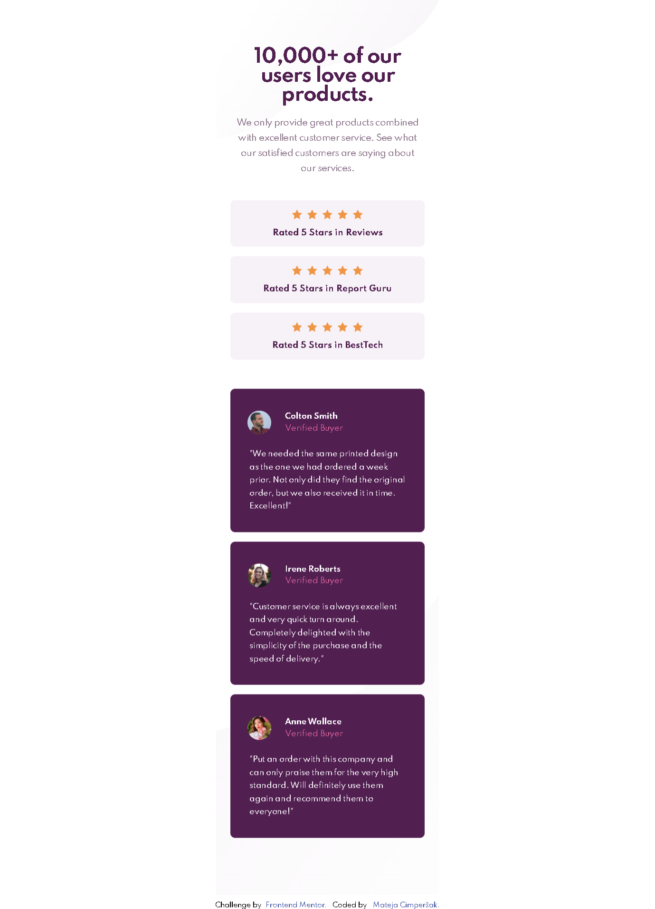
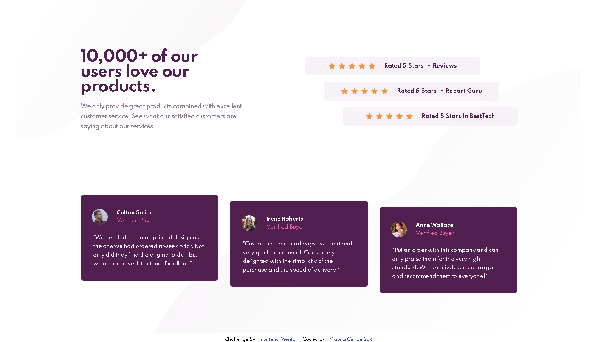

# Frontend Mentor - Social proof section solution

This is a solution to the challenge project: [Social proof section challenge on Frontend Mentor](https://www.frontendmentor.io/challenges/social-proof-section-6e0qTv_bA). 
## The challenge

Users should be able to:

- View the optimal layout depending on their device's screen size

## Screenshot

### Links

- [Solution URL](https://github.com/MatejaC/frontendmentor.io---social-proof-section-master)
- [Live Site URL](https://matejac.github.io/frontendmentor.io---social-proof-section-master/)

### Built with

- HTML
- CSS/SAAS/SCSS
- BEM methodology
- CSS Grid
- Flexbox
- mobile-first workflow
